# チーム開発GitHubことはじめ

## 準備
### ローカルで作業用ディレクトリの作成
任意のディレクトリで今回のリポジトリ用のディレクトリを「日付(YYYYMMDD)_github」で作成

```
$ mkdir 20210119_github
$ cd 20210119_github
```

作成したディレクトリに遷移していること

```
$ pwd
XXXXX/20210119_github
```

### git init
ローカルでgitの初期化

```
$ git init
Initialized empty Git repository in XXXXX/20210119_github/.git/
```

### README.mdの作成
README.mdの作成(touchで作成しているが普段利用しているエディタでも良い)

```
$ touch README.md
```

確認

```
$ ls
README.md
```

### add & commit
確認
```
$ git status
On branch main

No commits yet

Untracked files:
  (use "git add <file>..." to include in what will be committed)
	README.md

nothing added to commit but untracked files present (use "git add" to track)
```

add
```
$ git add README.md
```

commit

```
$ git commit -m "first"
```

確認

```
$ git status
On branch main
nothing to commit, working tree clean
```

### GitHubリポジトリの作成
右上プルダウン「New repository」もしくは左上緑色アイコンを押下

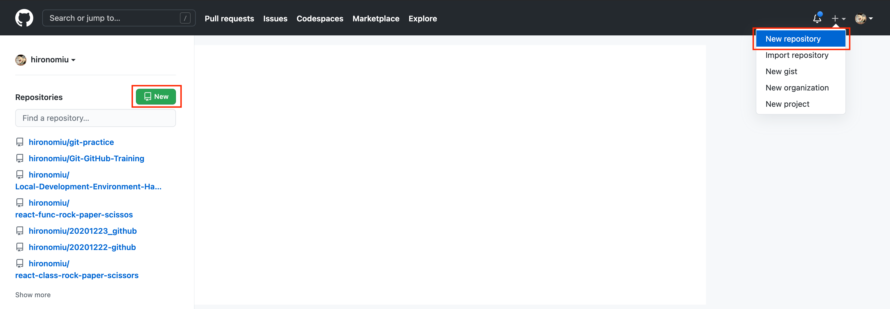

Repository name「日付(YYYYMMDD)_github」、その他特に選択せず(Publicを選択、「Initialize this repository with:」は何もチェックせず)、「Create repository」を押下

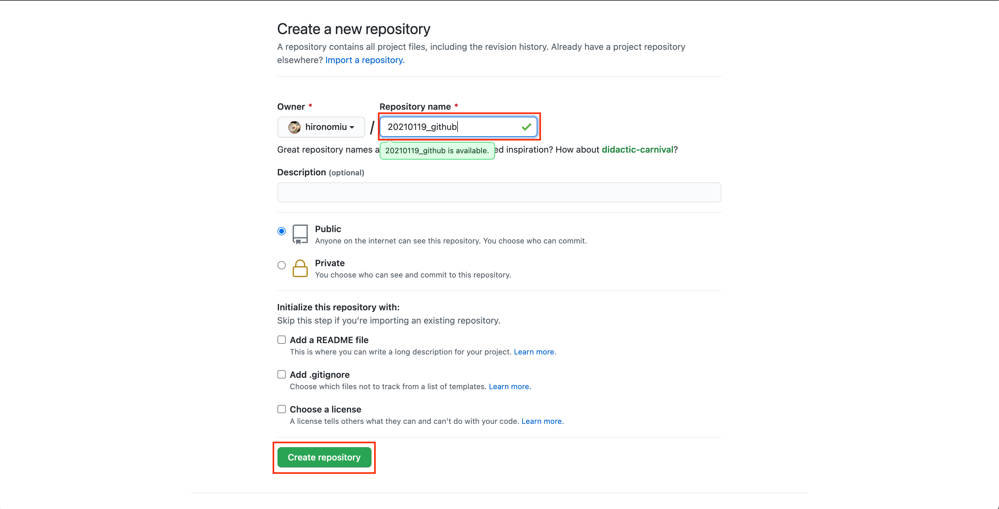

利用プロトコルは「SSH」を選択、「…or push an existing repository from the command line」内のコマンドをクリップボードにコピー

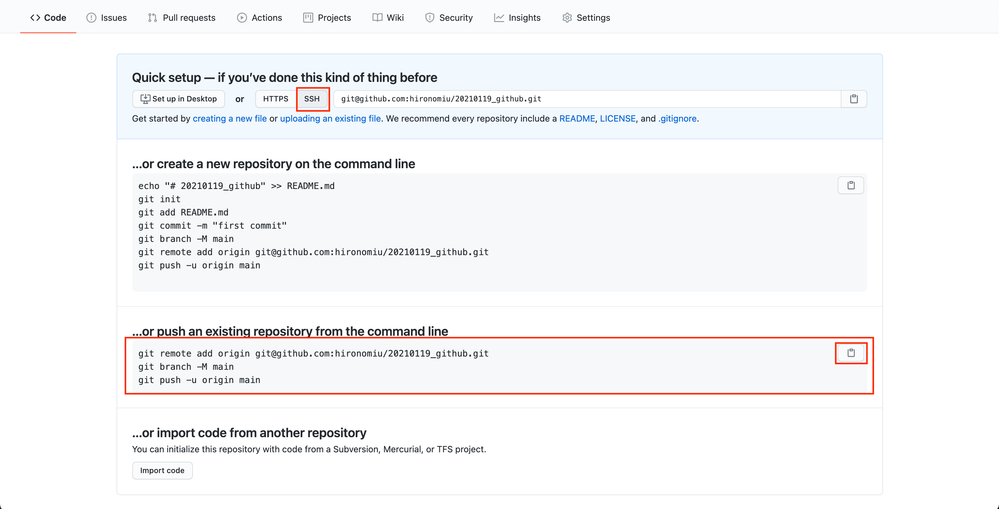

### リモートリポジトリの登録＆push
ターミナルにペースト

```
$ git remote add origin git@github.com:hironomiu/20210119_github.git
$ git branch -M main
$ git push -u origin main
Warning: Permanently added 'github.com,52.69.186.44' (RSA) to the list of known hosts.
Enumerating objects: 3, done.
Counting objects: 100% (3/3), done.
Writing objects: 100% (3/3), 204 bytes | 204.00 KiB/s, done.
Total 3 (delta 0), reused 0 (delta 0), pack-reused 0
To github.com:hironomiu/20210119_github.git
 * [new branch]      main -> main
Branch 'main' set up to track remote branch 'main' from 'origin'.
```

### リロード
GitHubリポジトリをリロードしpushが成功していることを確認

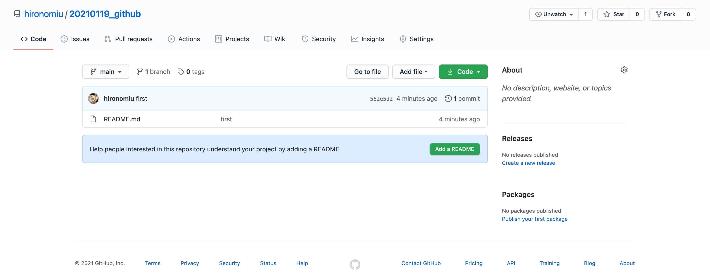

## チームメンバー招待
準備で作成したリポジトリにチームメンバーを「コラボレータ」機能を用いて招待する

### collaboratorsに招待
「settings」タブを選択

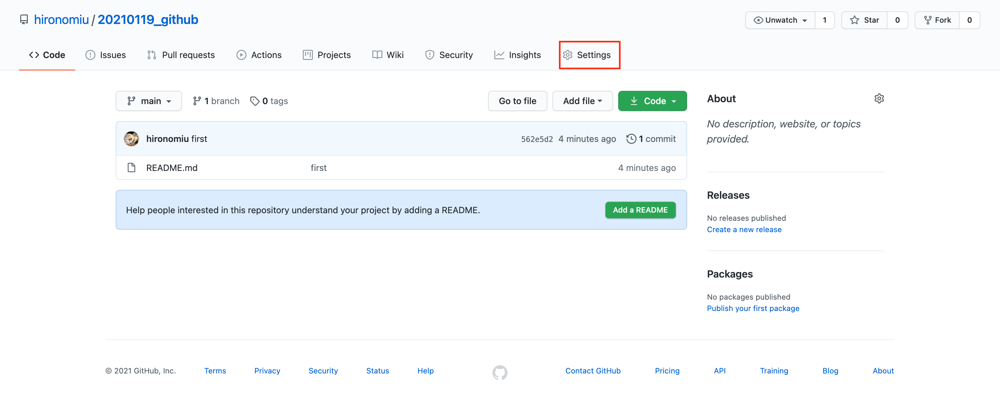

「Manage access」タブを選択

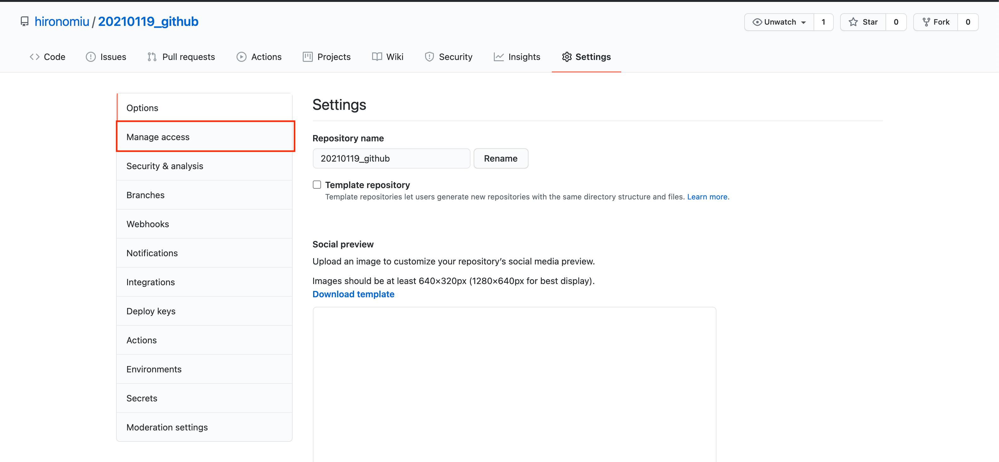

GitHubアカウントのパスワードを入力し押下


「invite a collaborator」を押下、招待するチームメンバーのGitHubアカウントを入力、下部にサジェストされるGitHubアカウントでチームメンバーのアカウントを選択(青くなる)し押下

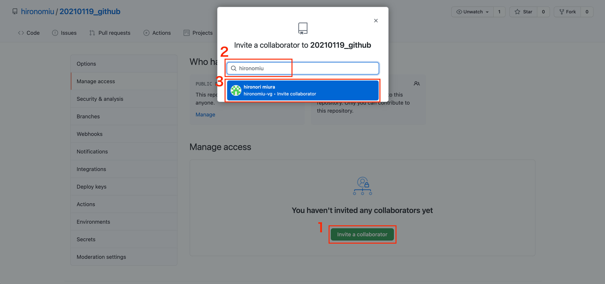

「Add XXXXX this repository」を押下

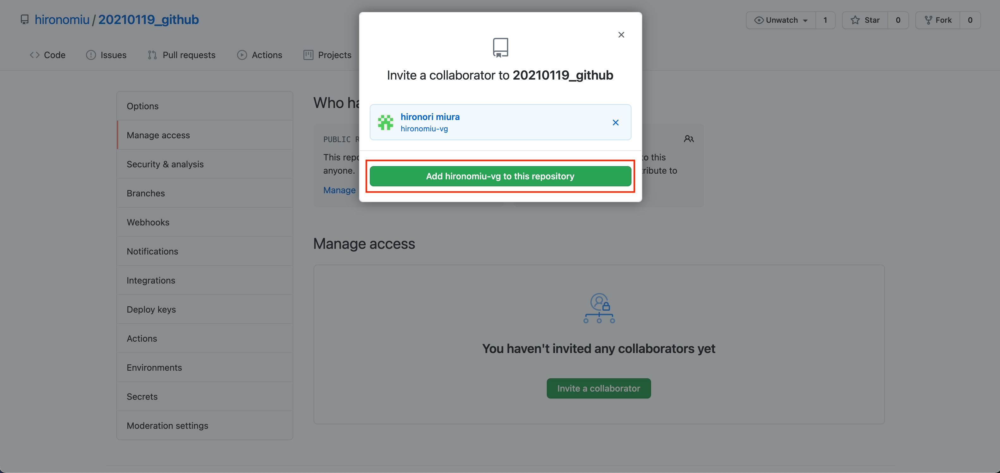

招待されたチームメンバーにメールが届き、JOINすると「Pending invite」のステータスが招待済のステータスに変わります


## チームメンバーとしてオペレーション

### チームリポジトリにアクセス
collaboratorsに招待されたGitHubリポジトリにアクセスし「code」を押下、「SSH」を選択しクリップボードにコピー

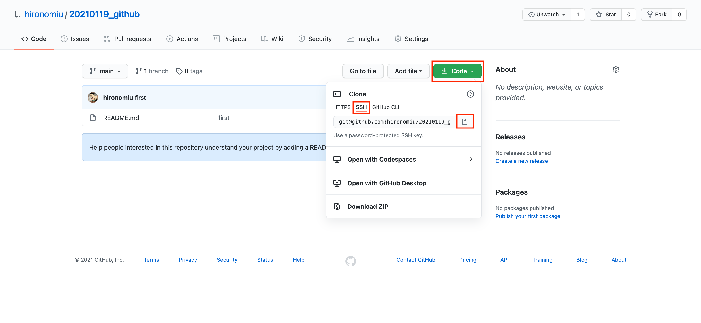

### clone
任意のディレクトリでクリップボードにコピーしたgit repoのgit cloneを行う

```
$ git clone git@github.com:XXXXX/20210119_github.git
```

ディレクトリ遷移

```
$ cd 20210119_github
$ pwd
xxxxx/20210119_github
```

## チーム開発想定のオペレーション
チームでするべきissueを作成し、それを各メンバーが行うことでチーム開発的なオペレーションのトレーニングを行います

### GitHub issueの作成
「issues」タブを選択、「New Issue「New issue」を押下

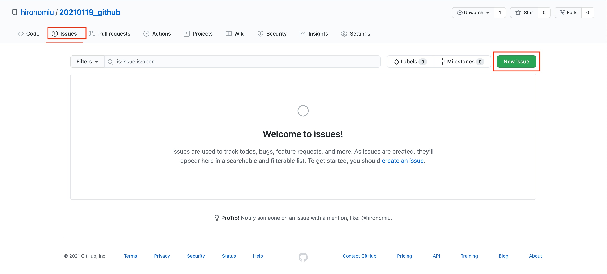

タイトル「<メンバー名>.mdの作成」の記載(<>内は各自のGitHubアカウント名)、Write「 <メンバー名>.mdの作成`hoge`の記載する」を記載し「Submit new issue」を押下

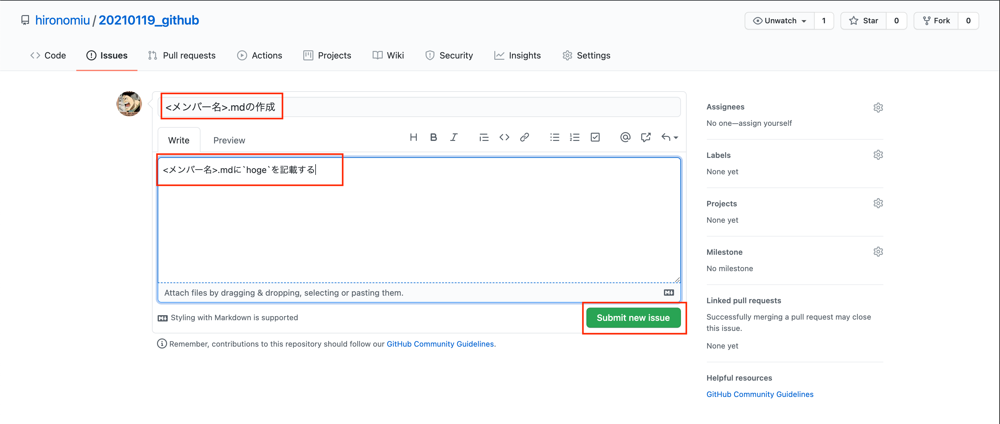

作成したissueのパーマリンクを覚えておくこと(issueに限らずGitHubではパーマリンクが作成される)

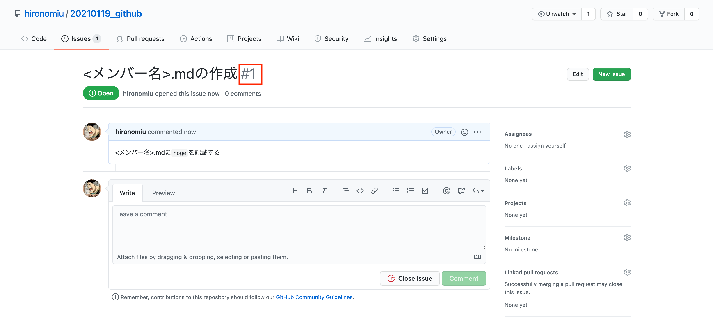

### ローカルで開発
現在のbranchを確認

```
$ git branch
* main
```

issueに紐づくbranchを作成(xxxxは各自のGitHubアカウント名)し遷移

```
$ git branch create_xxxx_markdownfile
$ git switch create_hironomiu_markdownfile
Switched to branch 'create_hironomiu_markdownfile'
```

確認

```
$ git branch
* create_hironomiu_markdownfile
  main
```

### 開発想定の作業
<メンバー名>.mdを作成し`hoge`を記載しセーブ

xxxxは各自のGitHubアカウント名

```
$ vi xxxx.md
$ cat xxxx.md
hoge
```

add & commit。commitメッセージに`fixed #1`を記載すること

```
$ git add .
$ git commit -m "create markdown file fixd #1"
[create_hironomiu_markdownfile 5a9a7dc] create markdown file fixd #1
 1 file changed, 1 insertion(+)
 create mode 100644 xxxx.md
```

push

```
$ git push origin create_hironomiu_markdownfile
Warning: Permanently added 'github.com,52.192.72.89' (RSA) to the list of known hosts.
Enumerating objects: 4, done.
Counting objects: 100% (4/4), done.
Delta compression using up to 4 threads
Compressing objects: 100% (2/2), done.
Writing objects: 100% (3/3), 290 bytes | 290.00 KiB/s, done.
Total 3 (delta 0), reused 0 (delta 0), pack-reused 0
remote:
remote: Create a pull request for 'create_hironomiu_markdownfile' on GitHub by visiting:
remote:      https://github.com/hironomiu/20210119_github/pull/new/create_hironomiu_markdownfile
remote:
To github.com:hironomiu/20210119_github.git
 * [new branch]      create_hironomiu_markdownfile -> create_hironomiu_markdownfile
```

「Pull requests」タブの選択、「New pull request」を押下


「compare」に今回pushしたbranchを選択、「Create pull request」を押下

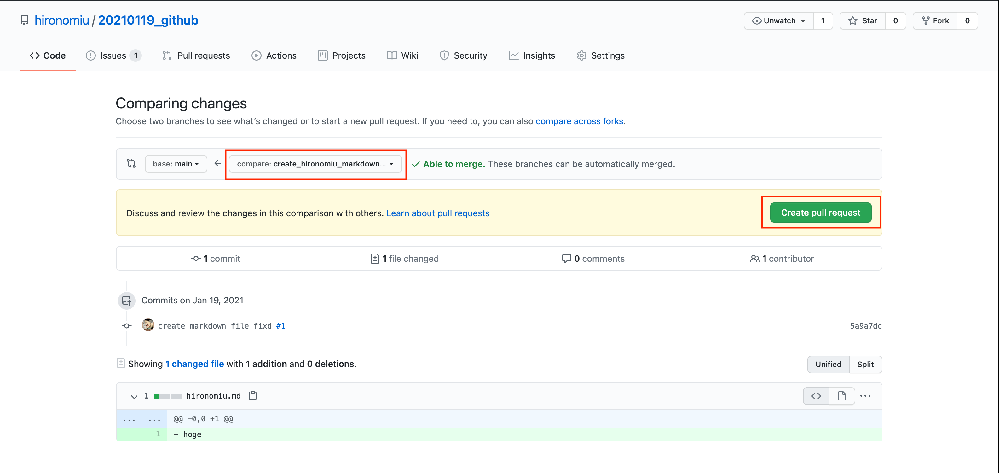

Writeにメッセージがあれば記載(本来はLGTMは取り込み時に入れるメッセージ)、「Create pull request」を押下

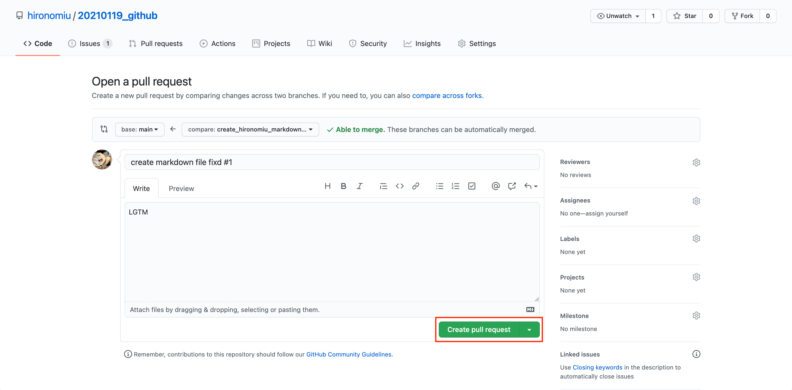

「Merge pull request」を押下(本来はPRの内容をレビューした後に行う)


「Confirm merge」を押下

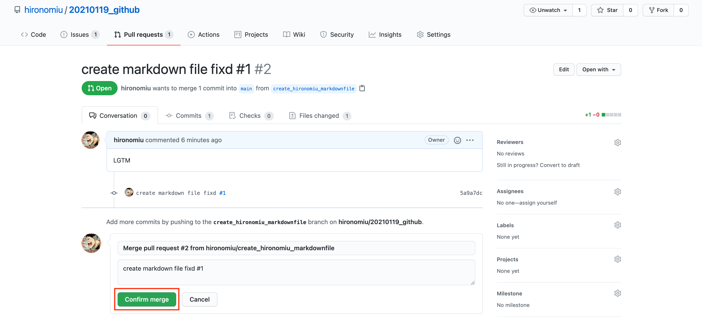

「Delete branch」を押下(チームによっては消さない運用を選択する場合もあるが今回は削除する)

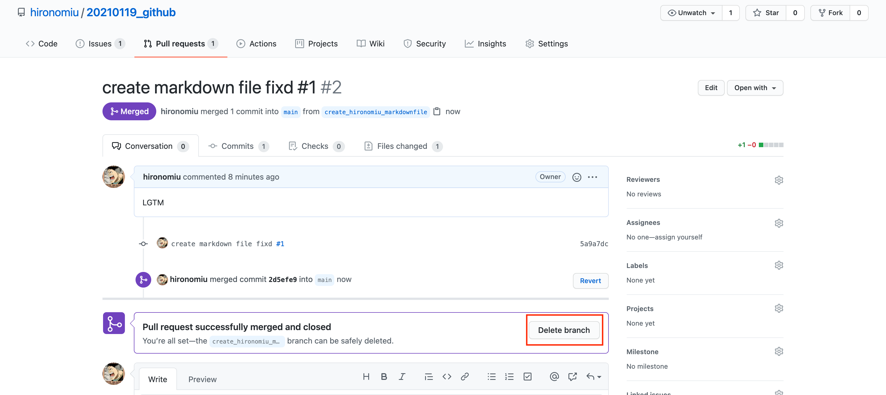

### ローカルに取り込み
- git switch main -> git fetch -> git merge

