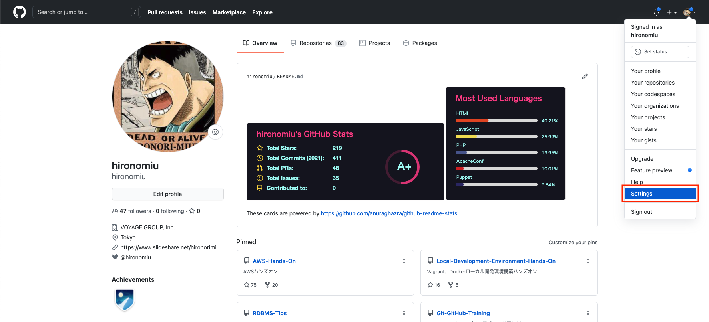
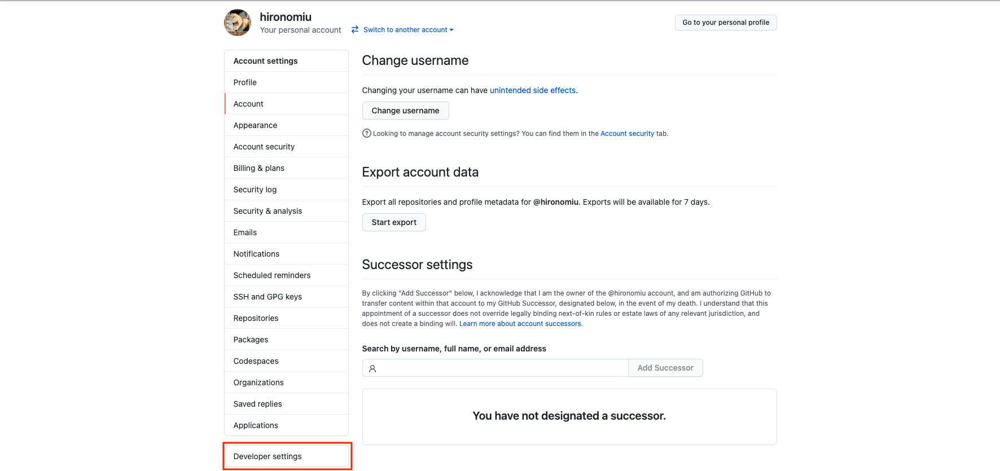
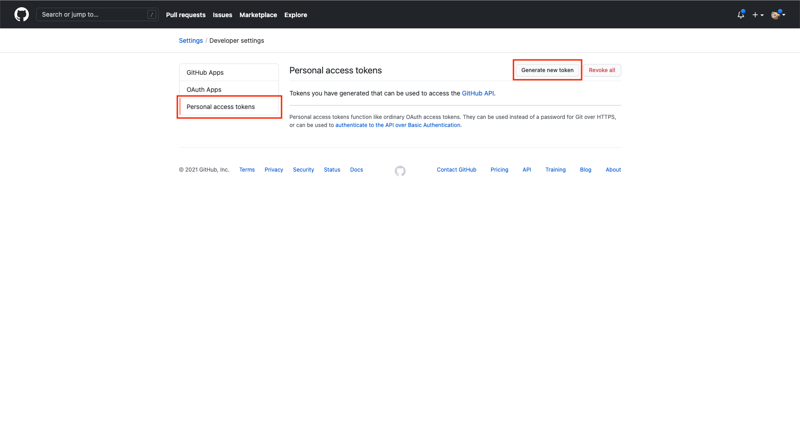
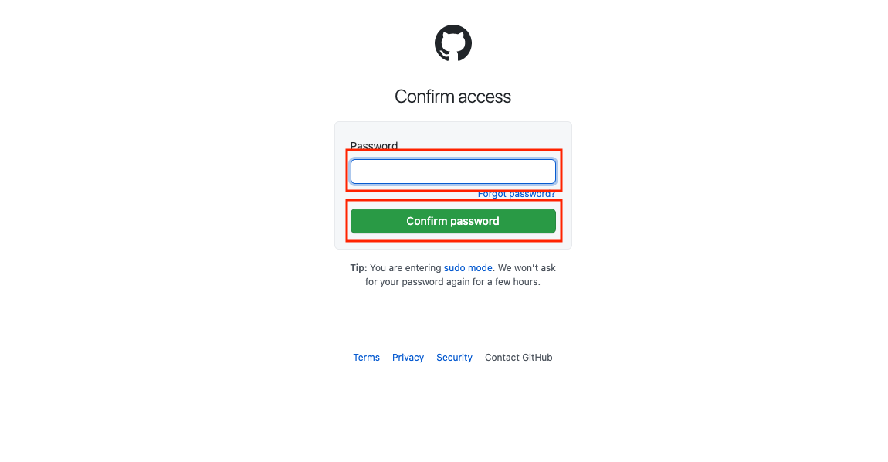
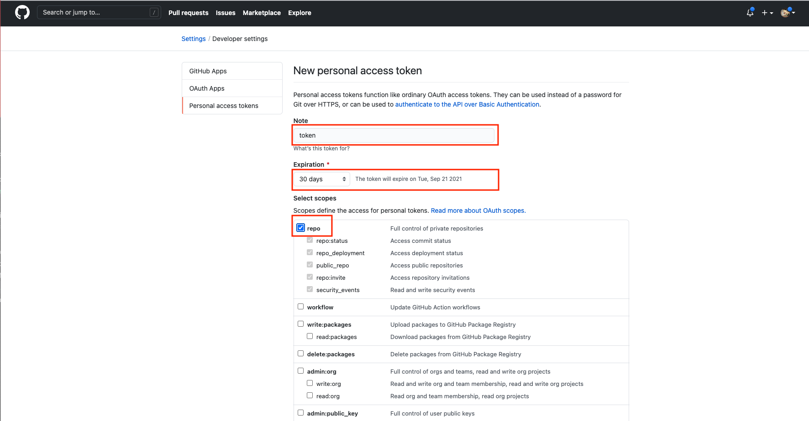
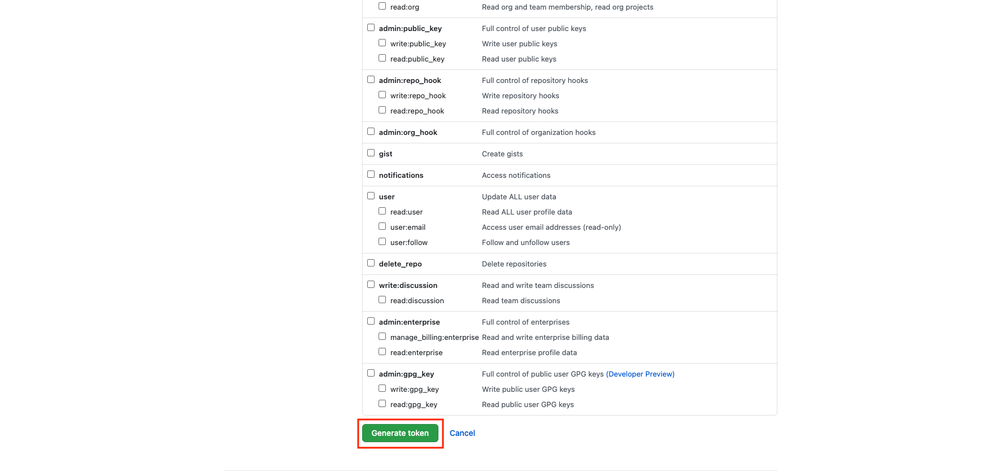
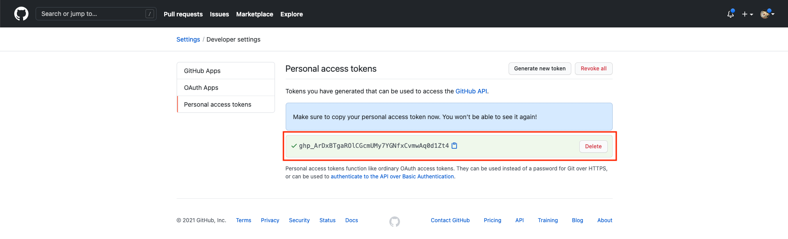

#　個人アクセストークンを利用し HTTPS 経由の GitHub の利用

`Settings`を押下

`Developer settings`を押下

`Personal access tokens`タブを押下、`Generate new token`を押下

パスワードを入力し`Confirm password`を押下

`Note`適時入力、`Expiration`有効期間を設定、`repo`今回はリポジトリを扱えるようにチェックを入れる

`Generate token`を押下

アクセストークンをコピーし保存する（以降は見えなくなる  が再生成は可能）

