# Git-GitHub-Training

## Git
基本的なgit操作(add,commit,etc)を学びます

### ディレクトリ作成と遷移
これから本演習を行うため任意のディレクトリでワークツリー用のディレクトリを作製し遷移しましょう
```
$ mkdir git-practice
$ cd git-practice/
```

### Authorの確認
今回はglobalで設定します(プロジェクト毎に設定したい場合はlocalで設定しましょう)初めての場合は以下のエラーがでます。
```
$ git config --global --list
fatal: unable to read config file ‘/Users/h-miura/.gitconfig’: No such file or directory
```

設定(自身のuser.name、user.emailに置き換えましょう)
```
$ git config --global user.name hironomiu
$ git config --global user.email hironomiu@gmail.com
$ git config --global --list
user.name=hironomiu
user.email=hironomiu@gmail.com
```

### デフォルトブランチの設定
デフォルトブランチを`main`で設定しましょう
```
$ git config --global init.defaultBranch main
```
### git操作
初期化によるローカルリポジトリの作製(ワークツリーの作製)
```
$ git init
Initialized empty Git repository in /xxxx/git-practice/.git/
```

branchの確認(何も表示されない。バージョンによっては`* master`が表示されることがある)
```
$ git branch
```

トラッキングの対象外の設定(`.gitignore`の作成)
```
$ touch .gitignore
$ ls .gitignore
.gitignore
```

giboを用いたトラッキングの対象外の設定(`.gitignore`の作成)。Macの場合`brew install gibo`でインストールでできる
```
$ gibo dump macOS >> .gitignore
```

ワークツリーでREADME.mdファイルの作成と編集
```
$ vi README.md
$ cat README.md
# git-practice
```

ステータス確認
`.gitignore``README.md`がインデックス対象となっていること
```
$ git status
On branch main

No commits yet

Untracked files:
  (use "git add <file>..." to include in what will be committed)
	.gitignore
	README.md

nothing added to commit but untracked files present (use "git add" to track)
```

add(インデックスに登録)
```
$ git add README.md
$ git add .gitignore
```

ステータス確認
`.gitignore``README.md`がコミット対象となっていること
```
$ git status
On branch main

No commits yet

Changes to be committed:
  (use "git rm --cached <file>..." to unstage)
	new file:   .gitignore
	new file:   README.md
```

コミット(commit)でローカルリポジトリに記録。`-m`でコミットメッセージを記載しましょう
```
$ git commit -m "created .gitignore README.md"
[main (root-commit) fc9aa86] created .gitignore README.md
 2 files changed, 31 insertions(+)
 create mode 100644 .gitignore
 create mode 100644 README.md
```

ブランチの確認
```
$ git branch
* main
```

ステータス確認
```
$ git status
On branch main
nothing to commit, working tree clean
```

ログの確認
```
$ git log
commit fc9aa867672f8bf471269849487933d15e92c81b (HEAD -> main)
Author: hironomiu <hironomiu@gmail.com>
Date:   Wed Nov 25 14:31:24 2020 +0900

    created .gitignore README.md
```

Author,Commiterを確認
```
$ git log --pretty=fuller
commit fc9aa867672f8bf471269849487933d15e92c81b (HEAD -> main)
Author:     hironomiu <hironomiu@gmail.com>
AuthorDate: Wed Nov 25 14:31:24 2020 +0900
Commit:     hironomiu <hironomiu@gmail.com>
CommitDate: Wed Nov 25 14:31:24 2020 +0900

    created .gitignore README.md
```

README.mdの末行に`hogefugapiyo`の追記
```
$ vi README.md
$ cat README.md
# git-practice
hogefugapiyo
```

`git diff`で追記した`README.md`との差分を確認する
```
$ git diff README.md
diff --git a/README.md b/README.md
index 3e4b5a2..4d69739 100644
--- a/README.md
+++ b/README.md
@@ -1 +1,2 @@
 # git-practice
+hogefugapiyo
```

ステータスの確認
```
$ git status
On branch main
Changes not staged for commit:
  (use "git add <file>..." to update what will be committed)
  (use "git restore <file>..." to discard changes in working directory)
	modified:   README.md

no changes added to commit (use "git add" and/or "git commit -a")
```

ワーキングディレクトリ内の変更の取り消し(インデックス前の取り消し)
```
$ git restore README.md
```

追記した内容以前に戻っていること
```
$ cat README.md
# git-practice
```

ステータス確認
```
$ git status
On branch main
nothing to commit, working tree clean
```

README.mdの末行に`piyofugahoge`の追記
```
$ vi README.md
$ cat README.md
# git-practice
piyofugahoge
```

ステータス確認
```
$ git status
On branch main
Changes not staged for commit:
  (use "git add <file>..." to update what will be committed)
  (use "git restore <file>..." to discard changes in working directory)
	modified:   README.md

no changes added to commit (use "git add" and/or "git commit -a")
```

`git diff`で追記した`README.md`との差分を確認する
```
$ git diff README.md
diff --git a/README.md b/README.md
index 3e4b5a2..2565824 100644
--- a/README.md
+++ b/README.md
@@ -1 +1,2 @@
 # git-practice
+piyofugahoge
```

addでインデックスに登録する(`git add .`の`.`はカレントディレクトリ全てを指定する意味)
```
$ git add .
```

ステータス確認
```
$ git status
On branch main
Changes to be committed:
  (use "git restore --staged <file>..." to unstage)
	modified:   README.md
```

差分の確認(何も返らない)
```
$ git diff README.md
```

インデックスの登録を取り消す
```
$ git restore --staged README.md
```

ステータス確認
```
$ git status
On branch main
Changes not staged for commit:
  (use "git add <file>..." to update what will be committed)
  (use "git restore <file>..." to discard changes in working directory)
	modified:   README.md

no changes added to commit (use "git add" and/or "git commit -a")
```

差分の確認。README.mdの末行に`piyofugahoge`の追記が存在すること
```
$ git diff README.md
diff --git a/README.md b/README.md
index 3e4b5a2..2565824 100644
--- a/README.md
+++ b/README.md
@@ -1 +1,2 @@
 # git-practice
+piyofugahoge
```

ファイル確認(変更内容は残っている)
```
$ cat README.md
# git-practice
piyofugahoge
```

add(インデックス登録)
```
$ git add .
```

ステータス確認
```
$ git status
On branch main
Changes to be committed:
  (use "git restore --staged <file>..." to unstage)
	modified:   README.md
```

コミット(commit)でローカルリポジトリに記録
```
$ git commit -m "modify README.md"
[main b85751a] modify README.md
 1 file changed, 1 insertion(+)
```

ステータス確認(`add commit`の対象が存在しないこと)
```
$ git status
On branch main
nothing to commit, working tree clean
```

これまでのコミットログの確認(ログは下から上で時系列に並ぶ)
```
$ git log
commit b85751a3f95a9abd5815174cd5b78aaf2c8cc487 (HEAD -> main)
Author: hironomiu <hironomiu@gmail.com>
Date:   Wed Nov 25 14:49:47 2020 +0900

    modify README.md

commit fc9aa867672f8bf471269849487933d15e92c81b
Author: hironomiu <hironomiu@gmail.com>
Date:   Wed Nov 25 14:31:24 2020 +0900

    created .gitignore README.md
```

現在のREADME.mdの内容を確認
```
$ cat README.md
# git-practice
piyofugahoge
```

commitの取り消し(ワーキングディレクトリの内容も取り消し)
```
$ git reset --hard HEAD^
HEAD is now at fc9aa86 created .gitignore README.md
```

現在のREADME.mdの内容を確認
```
$ cat README.md
# git-practice
```

コミットログから`modify README.md`のコミットログが取り消されていることを確認する(最新のコミットの取り消し)
```
$ git log
commit fc9aa867672f8bf471269849487933d15e92c81b (HEAD -> main)
Author: hironomiu <hironomiu@gmail.com>
Date:   Wed Nov 25 14:31:24 2020 +0900

    created .gitignore README.md
```

**ここからはcommitの取り消し(インデックスに戻しワークツリーに戻す)を行う**

README.mdの末行に`piyofugahoge`の追記
```
$ vi README.md
$ cat README.md
# git-practice
piyofugahoge
```

add(インデックス登録)
```
$ git add .
```

commit(ローカルリポジトリに記録)
```
$ git commit -m "modify README.md"
[main cedfb1d] modify README.md
 1 file changed, 1 insertion(+)
```

コミットログから`modify README.md`が追加されていることの確認
```
$ git log
commit cedfb1d94834035a034682d6514f797d2a57ebd4 (HEAD -> main)
Author: hironomiu <hironomiu@gmail.com>
Date:   Wed Nov 25 15:33:53 2020 +0900

    modify README.md

commit fc9aa867672f8bf471269849487933d15e92c81b
Author: hironomiu <hironomiu@gmail.com>
Date:   Wed Nov 25 14:31:24 2020 +0900

    created .gitignore README.md
```

commitの取り消し(インデックスに戻す)
```
$ git reset --soft HEAD^
```

ステータスからコミット(`commit`)対象に`README.md`が存在することを確認
```
$ git status
On branch main
Changes to be committed:
  (use "git restore --staged <file>..." to unstage)
	modified:   README.md
```

ファイル確認(変更内容は残っている)
```
$ cat README.md
# git-practice
piyofugahoge
```

インデックスの取り消し
```
$ git restore --staged README.md
```

ファイルの確認
```
$ cat README.md
# git-practice
piyofugahoge
```

ステータスからインデックス(`add`)対象に`README.md`が存在することを確認
```
$ git status
On branch main
Changes not staged for commit:
  (use "git add <file>..." to update what will be committed)
  (use "git restore <file>..." to discard changes in working directory)
	modified:   README.md

no changes added to commit (use "git add" and/or "git commit -a")
```

README.mdのワークツリー上の変更`piyofugahoge`の取り消し
```
$ git restore README.md
```

ステータス確認
```
$ git status
On branch main
nothing to commit, working tree clean
```

ファイル確認し末行に`piyofugahoge`が存在しないこと
```
$ cat README.md
# git-practice
```

### Gitおさらい
インデックス
```
$ git add XX
```

コミット(`-m`でコミットメッセージを記載する)
```
$ git commmit -m "XXX"
```

差分の確認(様々な差分の確認方法があるので調べてみましょう)
```
$ git diff XX
```

状態の確認
```
$ git status
```

コミットログの確認
```
$ git log
```

## GitHub

### GitHubに公開鍵の登録
鍵が作成できない or 扱えない人は行わなくてOKです

#### 鍵の作成

メールアドレスはGitHubに登録しているメールアドレスを設定しましょう。パスフレーズは設定しましょう

```
ssh-keygen -t rsa -b 4096 -C "your_email@example.com"
Generating public/private rsa key pair.
Enter file in which to save the key (/Users/miurahironori/.ssh/id_rsa): ファイル名(省略した場合はid_rsa)
Enter passphrase (empty for no passphrase): パスフレーズ
Enter same passphrase again: パスフレーズ
Your identification has been saved in hoge.
Your public key has been saved in hoge.pub.
The key fingerprint is:
SHA256: hironomiu@gmail.com
The key's randomart image is:
+---[RSA 4096]----+

+----[SHA256]-----+
```
#### 公開鍵のコピー
クリップボードに公開鍵をコピーしましょう
```
$ cat id_rsa.pub
```

#### 鍵の登録
右上からsettings -> SSH and GPG keys -> New SSH key押下

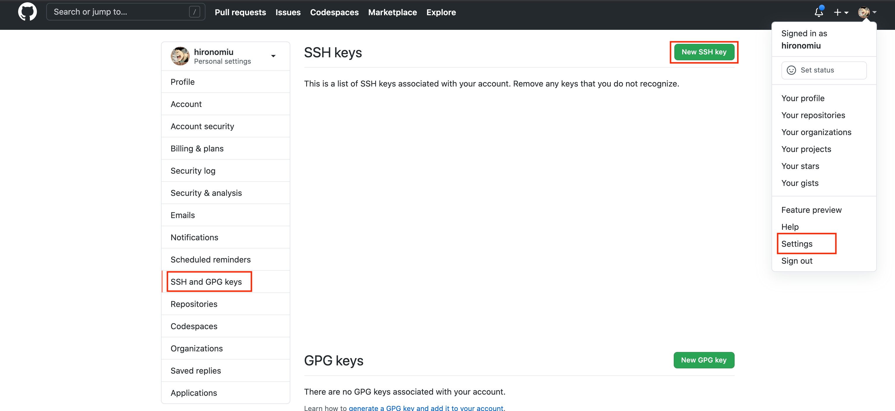

Title記入 -> Key(作成したid_rsa.pubの内容をコピペ) -> Add SSH key押下

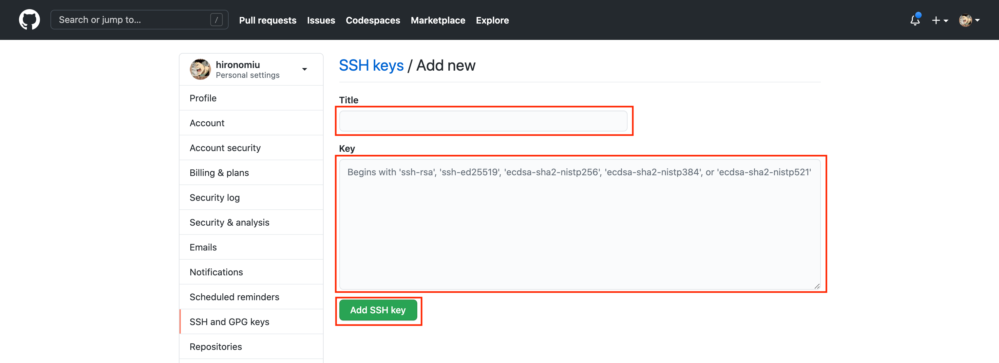

#### 確認
sshコマンドで`git`ユーザで`github.com`に対して接続確認を行う
```
$ ssh git@github.com
Enter passphrase for key ;
PTY allocation request failed on channel 0
Hi hironomiu! You've successfully authenticated, but GitHub does not provide shell access.
Connection to github.com closed.
```

### リポジトリの作成
これからの演習で使うGitHubリポジトリを`git-practice`で作成しましょう

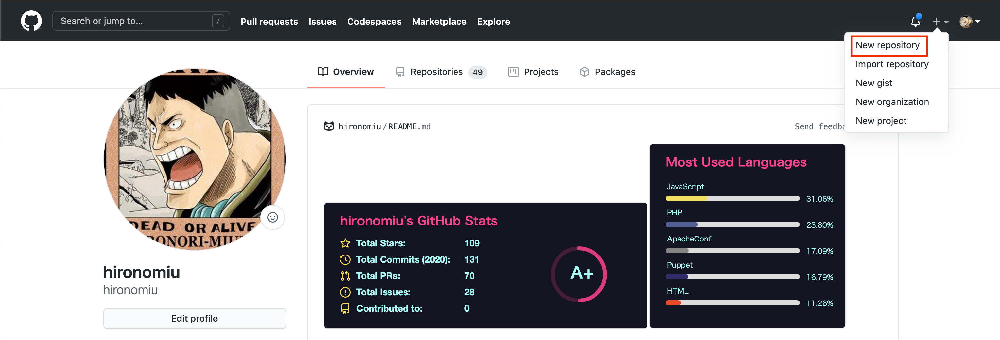

`Repository name`に`git-practice`を記載 -> Create repositoryを押下

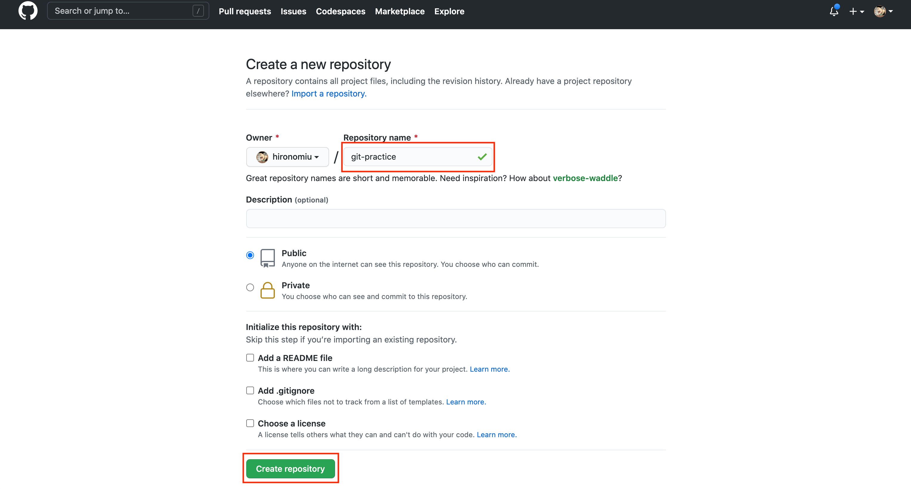

ローカルでは事前にリポジトリを作成しているので`…or push an existing repository from the command line`内に記載された内容を全てローカルで実行しましょう(パスフレーズを要求されたら設定したパスフレーズを入力しましょう)

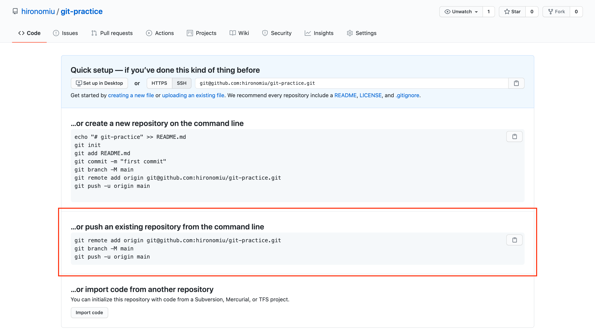

注：以下`XXX`は各自のGitHubアカウント名となる
```
$ git remote add origin git@github.com:XXX/git-practice.git
$ git branch -M main
$ git push -u origin main
Warning: Permanently added 'github.com,52.192.72.89' (RSA) to the list of known hosts.
Enumerating objects: 4, done.
Counting objects: 100% (4/4), done.
Delta compression using up to 4 threads
Compressing objects: 100% (3/3), done.
Writing objects: 100% (4/4), 635 bytes | 635.00 KiB/s, done.
Total 4 (delta 0), reused 0 (delta 0), pack-reused 0
To github.com:XXX/git-practice.git
 * [new branch]      main -> main
Branch 'main' set up to track remote branch 'main' from 'origin'.
```

ブラウザをリロードしてGitの演習で作成した内容が反映されていることを確認しましょう

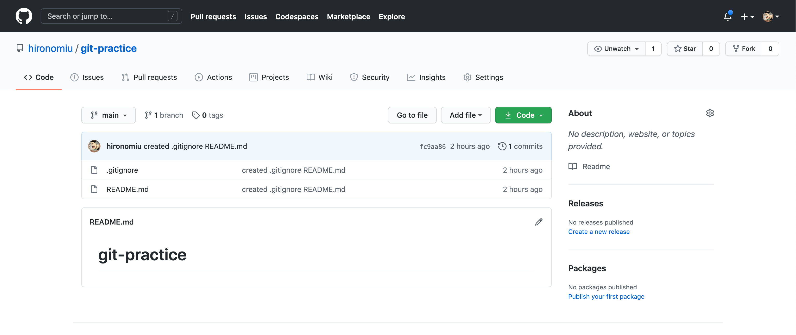

### 開発サイクル
ここからはGitとGitHubを組み合わせ、開発サイクルで使われる代表的な機能を「issue、branch、add、commit、push、pull request、merge」を用いて行います

### issue
GitHubの画面から

issues -> New issue押下

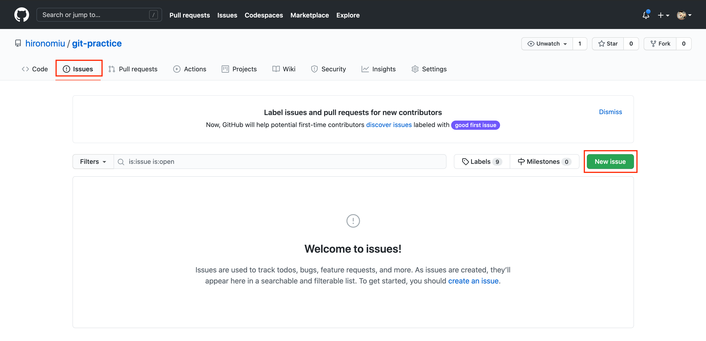

title`README編集`Write`fugahogepiyoを追記する`を記載 -> Submit new issue押下

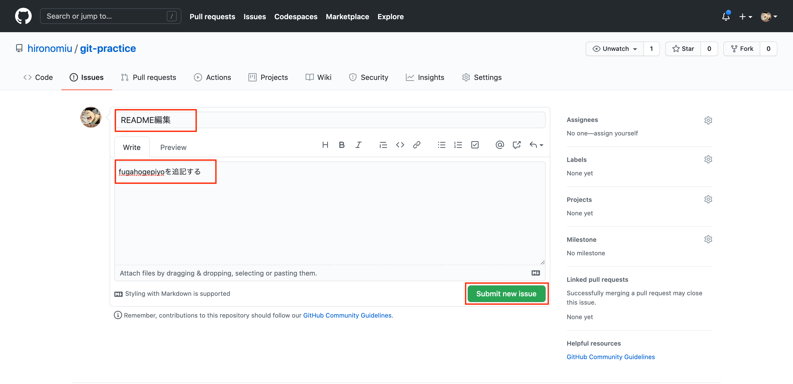

issueが登録されていること`#1`はこのissueのパーマリンク。GitHubでは様々なパーマリンックがあります


### branch
ローカルリポジトリではデフォルトブランチのmainで活動してることを確認しましょう。`*`のポインターが付いているブランチが現在作業しているブランチです

```
$ git branch
* main
```

issueに紐づく作業を行うbranch`modify-readme`を作成しましょう

```
$ git branch modify-readme
$ git branch
* main
  modify-readme
```

作業するbranchを`main`から`modify-readme`に遷移しましょう

```
$ git switch modify-readme
Switched to branch 'modify-readme'
```

現在の作業branchが`modify-readme`にポインタが指し示していることを確認しましょう

```
$ git branch
  main
* modify-readme
```

### README.md編集
issueに記載した作業内容をREADME.mdに対して編集しましょう

```
$ vi README.md
$ cat README.md
# git-practice
fugahogepiyo
```

### add&commit
ステータス確認
```
$ git status
On branch modify-readme
Changes not staged for commit:
  (use "git add <file>..." to update what will be committed)
  (use "git restore <file>..." to discard changes in working directory)
	modified:   README.md

no changes added to commit (use "git add" and/or "git commit -a")
```

diff
```
$ git diff
diff --git a/README.md b/README.md
index 3e4b5a2..40551f9 100644
--- a/README.md
+++ b/README.md
@@ -1 +1,2 @@
 # git-practice
+fugahogepiyo
```

add
```
$ git add .
```

commit(コミットメッセージにissue`#1`の作業であることを記載しましょう)
```
$ git commit -m "#1 modify README.md"
[modify-readme 8f20d8c] #1 modify README.md
 1 file changed, 1 insertion(+)
```

ステータス確認
```
$ git status
On branch modify-readme
nothing to commit, working tree clean
```

### GitHub originの確認
GitHubリポジトリ(今回はこちらがorigin)を確認しましょう

注：`XXX`は各GitHubユーザが表示される

```
$ git remote -v
origin	git@github.com:XXX/git-practice.git (fetch)
origin	git@github.com:XXX/git-practice.git (push)
```

### push
作成したmodify-readmeをGitHubリポジトリ`git-practice`にpushしましょう

```
$ git push origin modify-readme
Enter passphrase for key '/Users/miurahironori/.ssh/id_rsa':
Enumerating objects: 5, done.
Counting objects: 100% (5/5), done.
Writing objects: 100% (3/3), 279 bytes | 139.00 KiB/s, done.
Total 3 (delta 0), reused 0 (delta 0)
remote:
remote: Create a pull request for 'modify-readme' on GitHub by visiting:
remote:      https://github.com/hironomiu/git-practice/pull/new/modify-readme
remote:
To github.com:hironomiu/git-practice.git
 * [new branch]      modify-readme -> modify-readme
```

GitHub上でpushされたbranchを確認しましょう

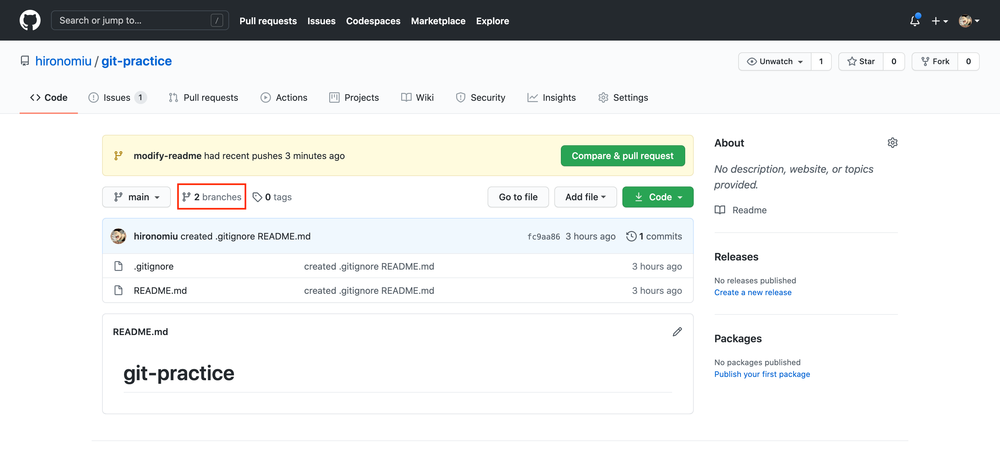

今会作成した`modify-readme`などが表示されていることを確認しましょう

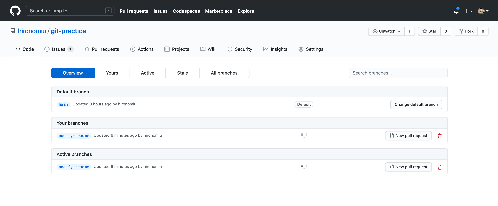

### pull requestの作成とmerge
GitHubの画面から`Pull request`タブを選択 -> `New pull request`を押下(`Compare & pull request`でも同様のことは可能)

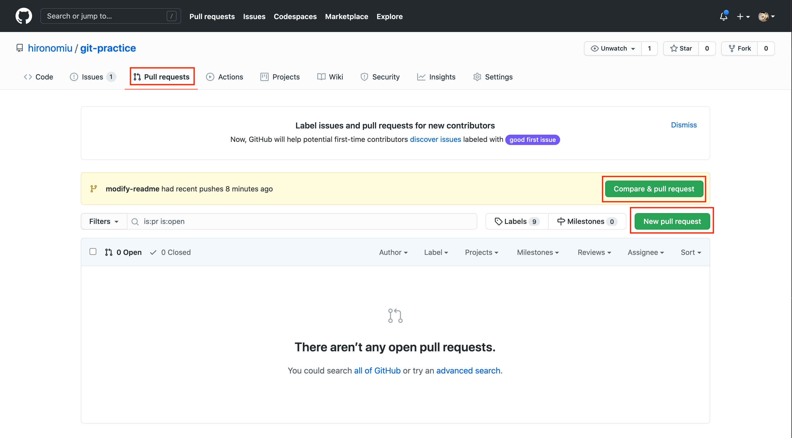

`modify-readme`を選択 -> `Create pull request`を押下

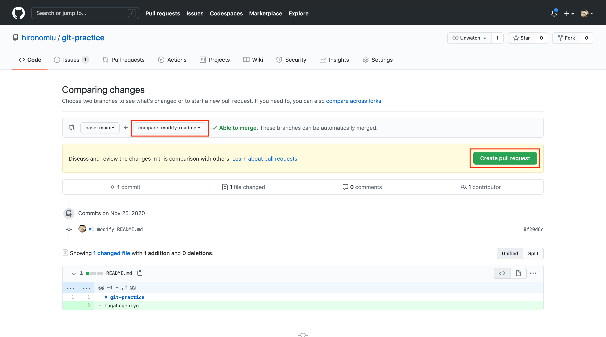

Write`fixed #1`を記載 -> `Create pull request`を押下

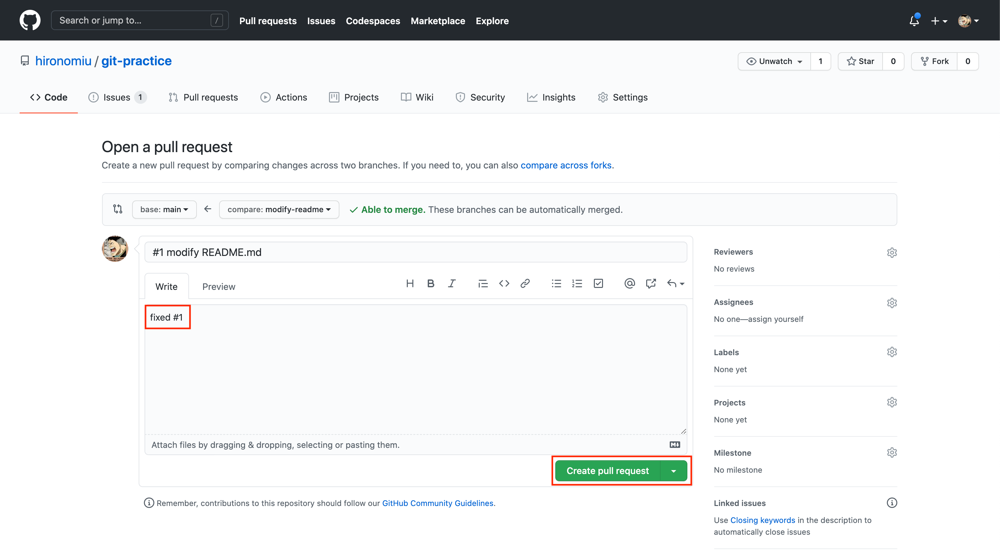

`Merge pull request`を押下(実際にはソースコードレビューを行った上で行う)

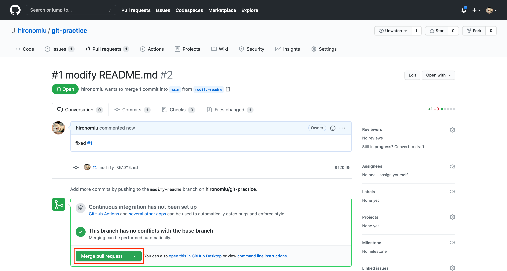

`Confirm merge`を押下

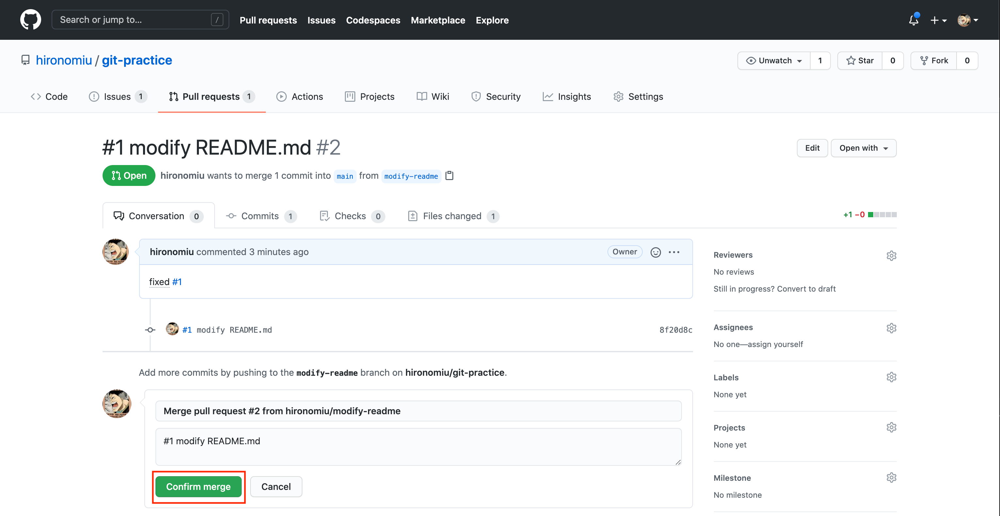

`Delete branch`を押下(開発スタイルで残したい場合は不要)


`Pull requests`タブを選択。pull requestが存在しない(closeされている)ことを確認

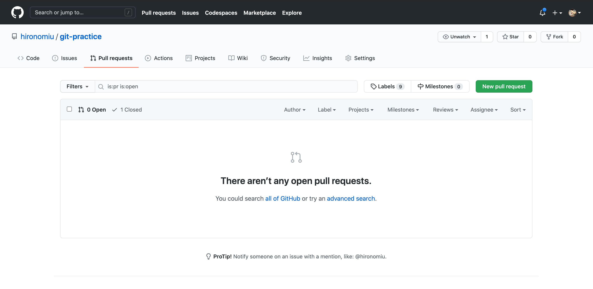

`issues`タブを選択。issueが存在しない(closeされている)ことを確認

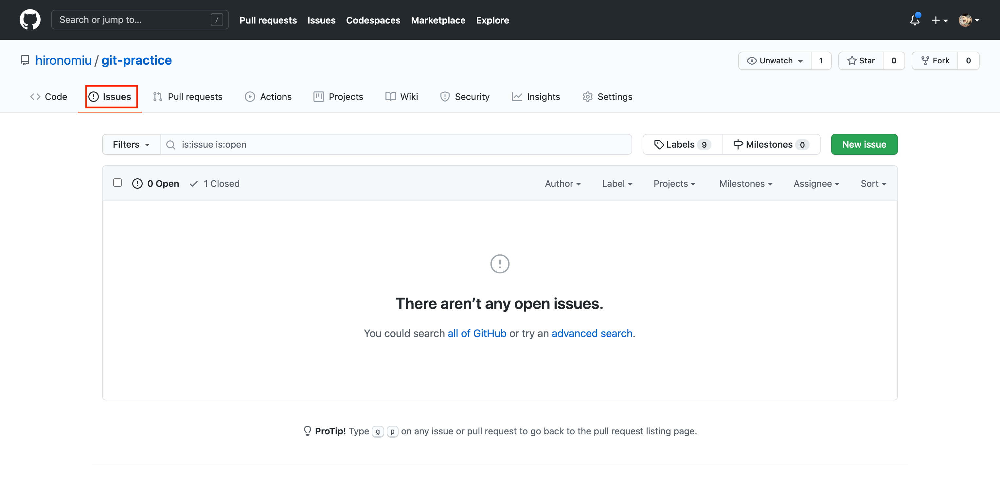

`<>Code`タブを選択`README.md`に`fugahogepiyo`が記載されていること

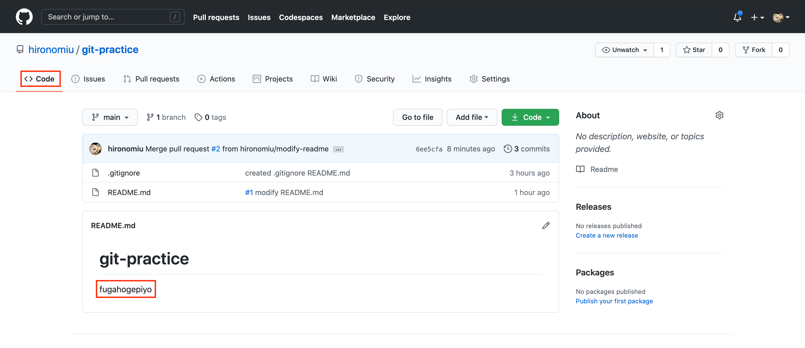

## ローカル取り込み(fetch & merge)
ここではリモートGitHubリポジトリのmainからローカルのmainに最新の取り込みを行います

branchの確認(このオペレーションでは`modify-readme`が作業branchとしてさされている)
```
$ git branch
  main
* modify-readme
```

mainbに遷移する
```
$ git switch main
Switched to branch 'main'
Your branch is up to date with 'origin/main'.
```

branchの確認(`main`を差していること)

```
$ git branch
* main
  modify-readme
```

リモートGitHubリポジトリのmainの最新をfetchでローカルに取得する

```
$ git fetch origin main
Warning: Permanently added 'github.com,52.69.186.44' (RSA) to the list of known hosts.
remote: Enumerating objects: 1, done.
remote: Counting objects: 100% (1/1), done.
remote: Total 1 (delta 0), reused 0 (delta 0), pack-reused 0
Unpacking objects: 100% (1/1), 620 bytes | 620.00 KiB/s, done.
From github.com:hironomiu/git-practice
 * branch            main       -> FETCH_HEAD
   fc9aa86..6ee5cfa  main       -> origin/main
```

diff
```
$ git diff HEAD FETCH_HEAD
diff --git a/README.md b/README.md
index 3e4b5a2..40551f9 100644
--- a/README.md
+++ b/README.md
@@ -1 +1,2 @@
 # git-practice
+fugahogepiyo
```

ローカルのmainリポジトリにリモートリポジトリから取得したFETCH_HEADをmergeで取り込みましょう

```
$ git merge FETCH_HEAD
Updating fc9aa86..6ee5cfa
Fast-forward
 README.md | 1 +
 1 file changed, 1 insertion(+)
```

diff(何もないので同じ状態)
```
$ git diff HEAD FETCH_HEAD
```

確認(リモートリポジトリの内容`fugahogepiyo`が取り込まれていることを確認)

```
$ cat README.md
# git-practice
fugahogepiyo
```

今回はリモートリポジトリからfetch->mergeでローカルリポジトリのmainに最新を取り込んだが、ローカルで別branchで開発した内容は直接mainにmergeすることも可能です

## CONFLICTの解消
ここではCONFLICTを発生させ解決していきます。ここまで行ったローカルリポジトリ(ターミナル1と呼ぶ)と別でもう一つローカルリポジトリを作成(`clone`にて、ターミナル2と呼ぶ)しオペレーションは行っていきます。

### clone
GitHubリポジトリ -> `Code`プルダウン -> `SSH`タブ選択 -> クリップボードにコピー

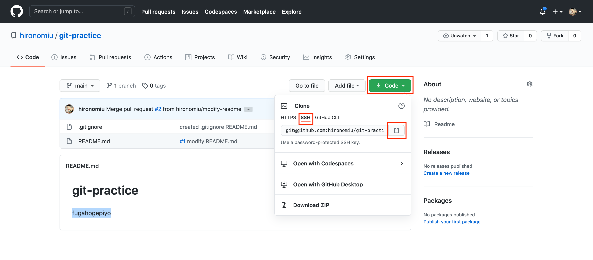

ここまでのローカルリポジトリのディレクトリとは別ターミナル(ターミナル２)を用意し、任意の別ディレクトリでクリップボードにコピーした内容を`git clone `のあとにペーストし実行しましょう

注：`XXX`はコピーした自分のGitHubアカウント名が入る

```
$ git clone git@github.com:XXX/git-practice.git
Cloning into 'git-practice'...
Enter passphrase for key '/Users/miurahironori/.ssh/id_rsa':
remote: Enumerating objects: 19, done.
remote: Counting objects: 100% (19/19), done.
remote: Compressing objects: 100% (8/8), done.
remote: Total 19 (delta 4), reused 17 (delta 3), pack-reused 0
Receiving objects: 100% (19/19), done.
Resolving deltas: 100% (4/4), done.
```

ディレクトリ遷移

```
$ cd git-practice
```

### ターミナル1(最初のリポジトリ)で作業

`first`branchの作成と遷移、確認(`first`を指し示していること)

```
$ git branch first
$ git switch first
Switched to branch 'first'
$ git branch
* first
  main
  modify-readme
```

README.mdの末行に`first`の追記編集
```
$ vi README.md
$ cat README.md
# git-practice
fugahogepiyo
first
```

addとcommit
```
$ git add .
$ git commit -m "first"
[first b103e8d] first
 1 file changed, 1 insertion(+)
```

GitHubリポジトリに`first`branchをpush

```
# git push origin first
Warning: Permanently added 'github.com,13.114.40.48' (RSA) to the list of known hosts.
Enumerating objects: 5, done.
Counting objects: 100% (5/5), done.
Delta compression using up to 4 threads
Compressing objects: 100% (2/2), done.
Writing objects: 100% (3/3), 302 bytes | 302.00 KiB/s, done.
Total 3 (delta 0), reused 0 (delta 0), pack-reused 0
remote:
remote: Create a pull request for 'first' on GitHub by visiting:
remote:      https://github.com/hironomiu/git-practice/pull/new/first
remote:
To github.com:hironomiu/git-practice.git
 * [new branch]      first -> first
```

branchesタブを選択し`first`branchが存在することを確認

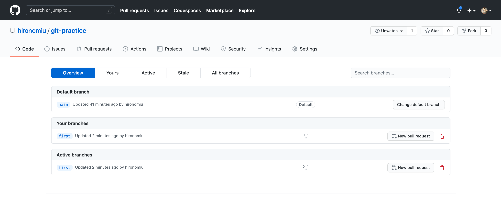

### ターミナル2(新しいリポジトリ)で作業

`second`branchの作成と遷移、確認(`second`を指し示していること)

```
$ git branch second
$ git switch second
Switched to branch 'second'
$ git branch
  main
* second
```

README.mdの末行に`second`の追記編集

```
$ vi README.md
$ cat README.md
# git-practice
fugahogepiyo
second
```

addとcommit

```
$ git add .
$ git commit -m "second"
[second 8534bb0] second
 1 file changed, 1 insertion(+)
```

GitHubリポジトリに`second`branchをpush

```
$ git push origin second
Warning: Permanently added 'github.com,13.114.40.48' (RSA) to the list of known hosts.
Enumerating objects: 5, done.
Counting objects: 100% (5/5), done.
Delta compression using up to 4 threads
Compressing objects: 100% (2/2), done.
Writing objects: 100% (3/3), 303 bytes | 303.00 KiB/s, done.
Total 3 (delta 0), reused 0 (delta 0), pack-reused 0
To github.com:hironomiu/git-practice.git
   6ee5cfa..8534bb0  second -> second
```

branchesタブを選択し`second`branchが存在することを確認

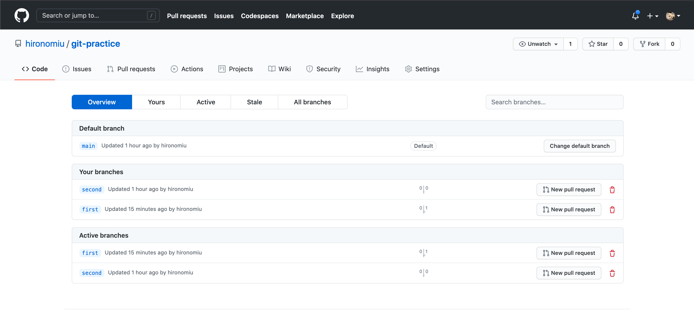

### ターミナル1、pull requestの作成とmerge

GitHubの画面から`Pull requests`タブ -> `New pull request`を押下

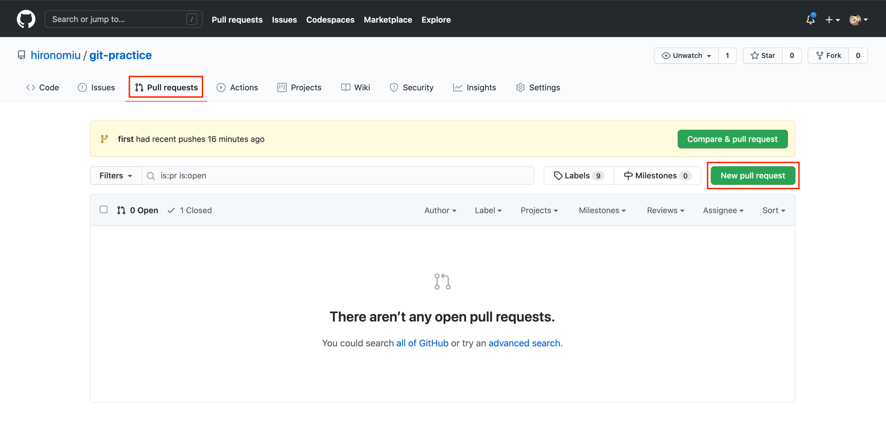

`first`branchを選択 -> `Create pull request`を押下

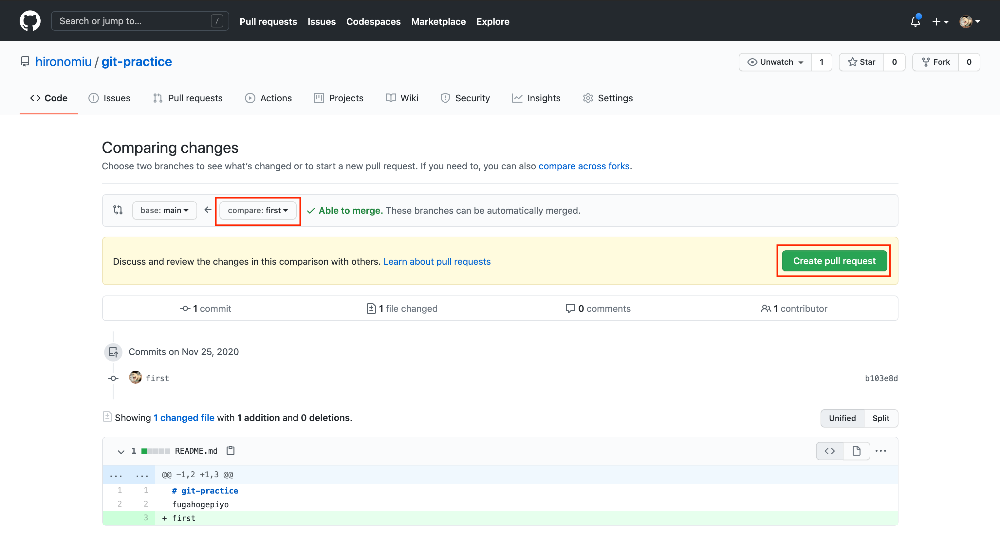

Write`first`を記載 -> `Create pull request`を押下

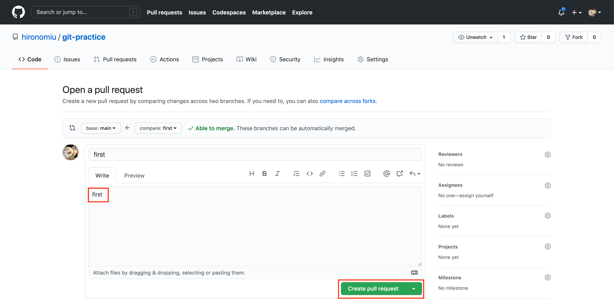

`Confirm merge`を押下

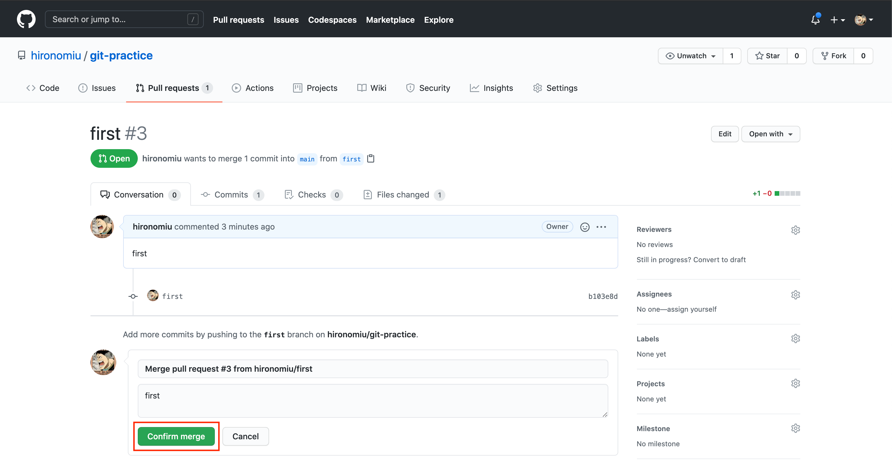

`Delete branch`は省略する

### ターミナル2、pull requestの作成とmerge

GitHubの画面から`Pull requests`タブ -> `New pull request`を押下


`second`branchを選択 -> `Create pull request`を押下

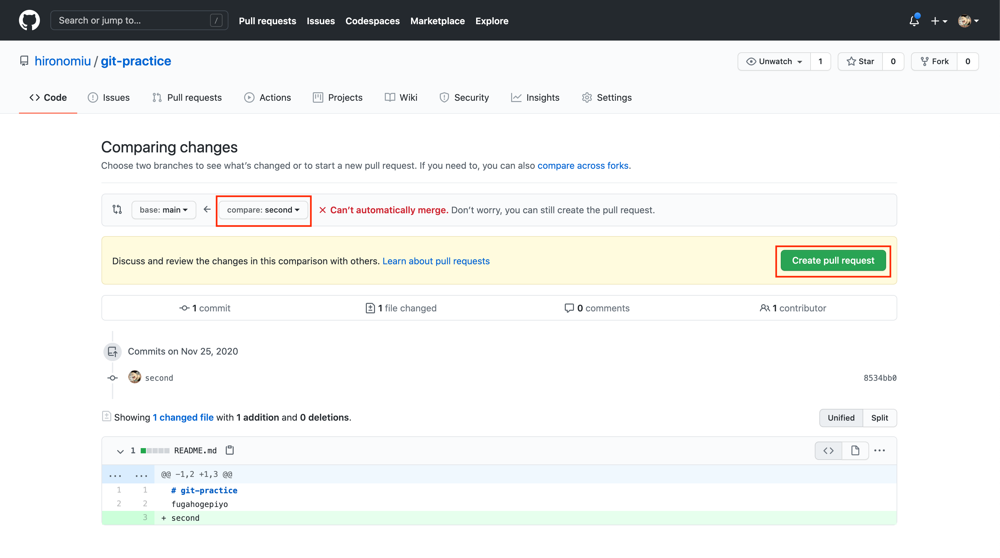

Write`second`を記載 -> `Create pull request`を押下

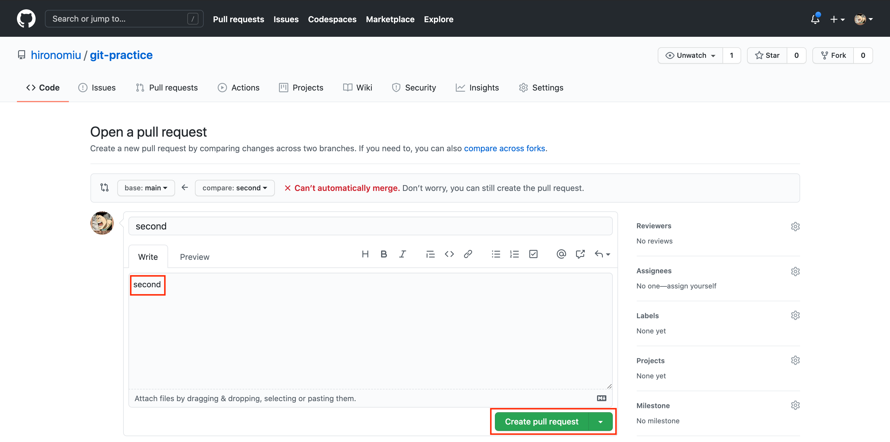

conflictが発生していることを確認

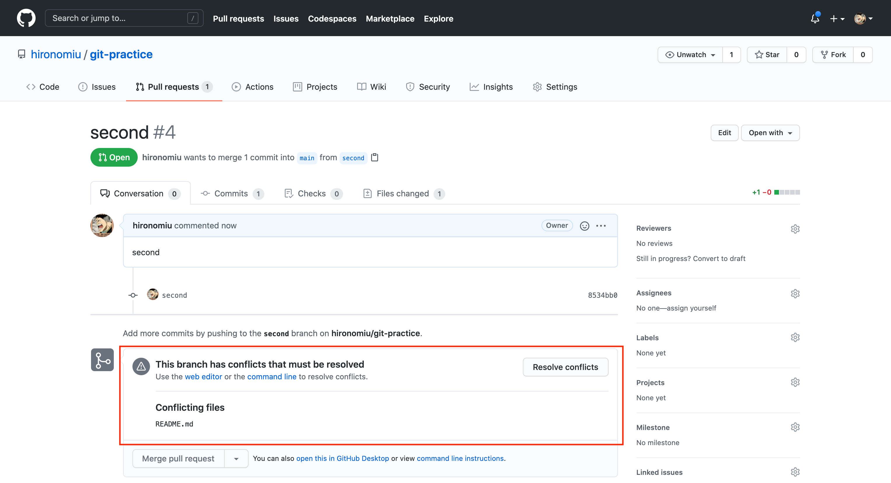

### ターミナル2でコンフリクトの解消
リモートリポジトリのmainの最新をfetch

```
$ git fetch origin main
```

branchの確認(`second`であること)
```
$ git branch
  main
* second
```

`second`branchにFETCH_HEADをmergeで取り込む

```
$ git merge FETCH_HEAD
Auto-merging README.md
CONFLICT (content): Merge conflict in README.md
Automatic merge failed; fix conflicts and then commit the result.
```

コンフリクトの内容を確認

```
$ cat README.md
# git-practice
fugahogepiyo
<<<<<<< HEAD
second
=======
first
>>>>>>> 7b868e363d289674d599834ca25fc0517cda97fe
```

CONFLICTを解消(今回は末行に`second`,`first`の順で編集、実際のコンフリクトはあるべき姿に編集する)
```
$ vi README.md
$ cat README.md
# git-practice
fugahogepiyo
second
first
```

add&commit
```
$ git add .
$ git commit -m "CONFLICTの修正"
[second a1807fb] CONFLICTの修正
```

リモートリポジトリに`second`branchの最新commitをpush
```
$ git push origin second
Warning: Permanently added 'github.com,52.69.186.44' (RSA) to the list of known hosts.
Enumerating objects: 7, done.
Counting objects: 100% (7/7), done.
Delta compression using up to 4 threads
Compressing objects: 100% (2/2), done.
Writing objects: 100% (3/3), 368 bytes | 368.00 KiB/s, done.
Total 3 (delta 0), reused 0 (delta 0), pack-reused 0
To github.com:hironomiu/git-practice.git
   8534bb0..a1807fb  second -> second
```

GitHubの`Pull reqests`タブ画面でグリーンになっていることを確認し`Merge pull request`を押下

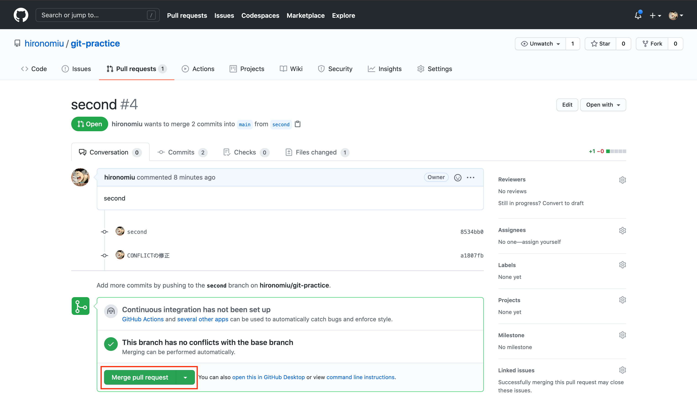

`Confirm merge`を押下

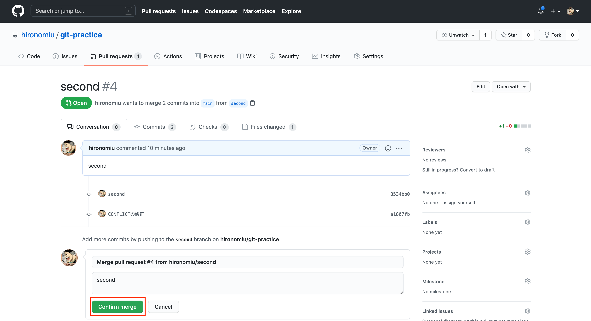

Delete branchは省略`<>Code`タブ、`README.md`に`second first`の記述が追加されていること

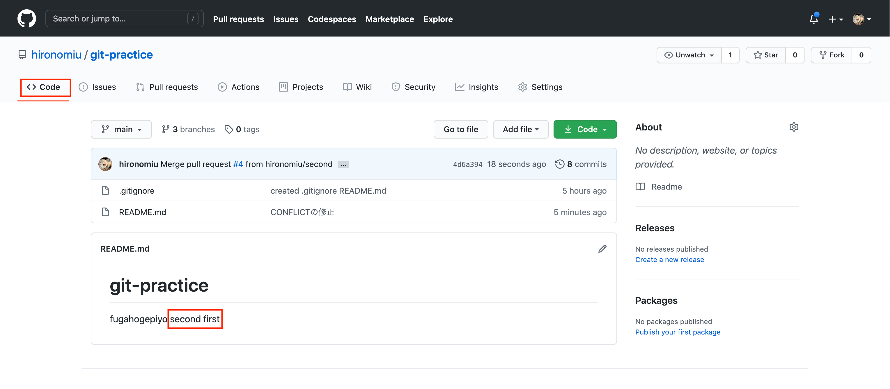

ここまででコンフリクトの解消は完了です